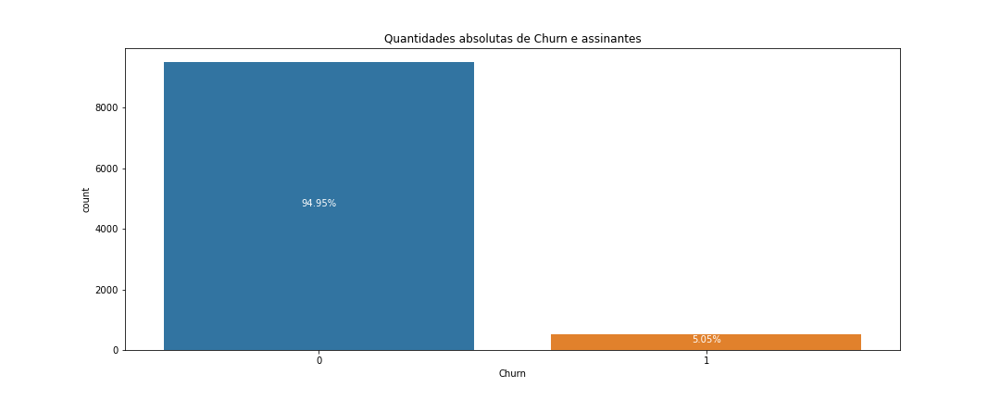
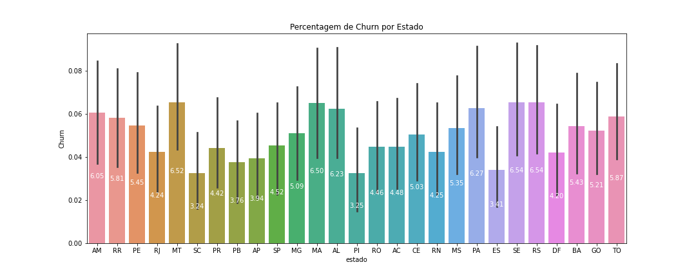
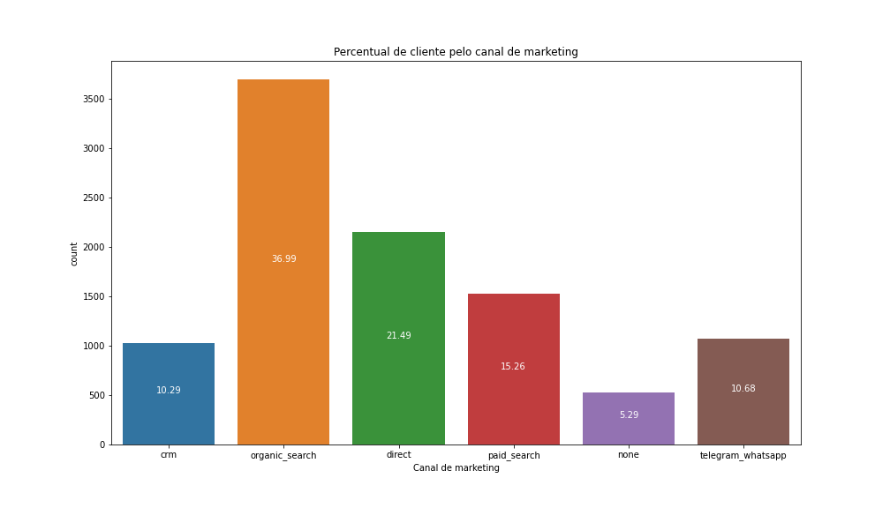
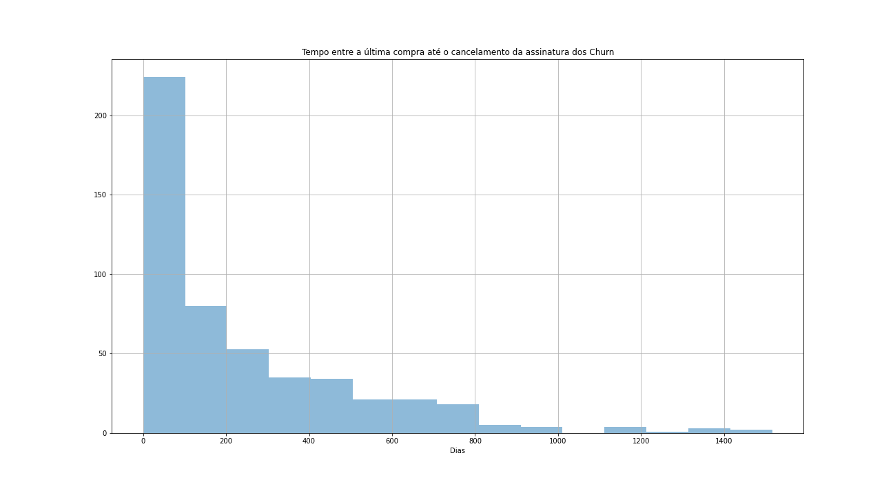
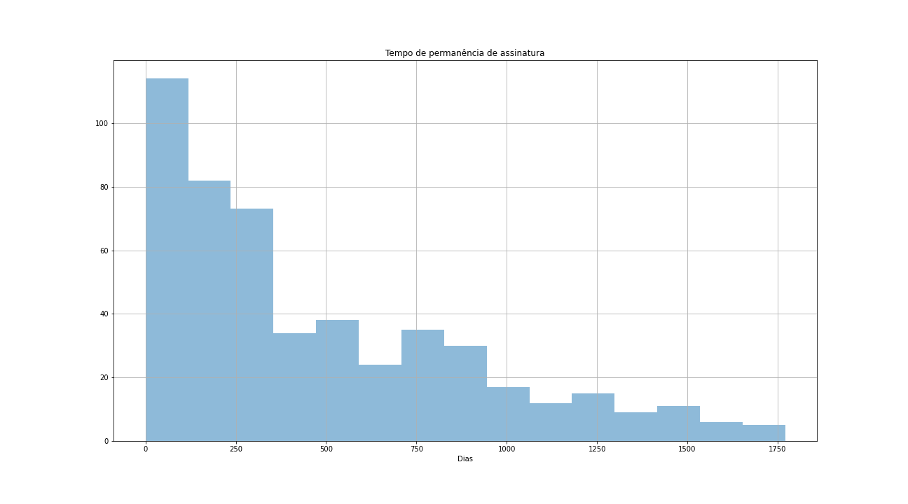

# Análise de Churn

Análise do Churn da empresa Petlove. O objetivo deste trabalho é o estudo do perfil das pessoas que cancelaram suas assinaturas na empresa Petlove, 
utilizando modelos visuais e estatísticos para serem enviados a gerência da empresa. 

- **Análise**

O notebook Analise_organizada.ipynb apresenta os comandos realizados para a análise. Nele foram investigados como os Churns estão distribuidos pela categorias. Primeiro observamos a percentagem de Churn pelo total clientes.

Avaliamos depois a percentagem de Churn por estado. Com o resultado observamos que os Churn apresenta-se distribuido pelos estado, sem demonstrar algum estado com um comportamento não usual. 

Vimos também a taxa de churn por marketing source. Assim sendo, o percentual de churn pelo canal de marketing que converteu a assinatura do cliente. 

 

Pode-se observar que embora a cadegoria none apresente a menor conversão de assinantes, ela tem o maior número de Churn, aliada a fonte de marketing telegram e whatsapp. 
Observando o tempo que leva para o cancelamento da assinatura e o período de tempo entre a última compra até o cancelamento da assinaturas temos

 

Obtemos com isso que as pessoas que não realizam suas compras até 100 dias, tem mais probabilidade de cancelarem suas assinaturas. Que coincide com o período de tempo que as pessoas que cancelaram suas assinaturas permaneceram como assinantes. 
